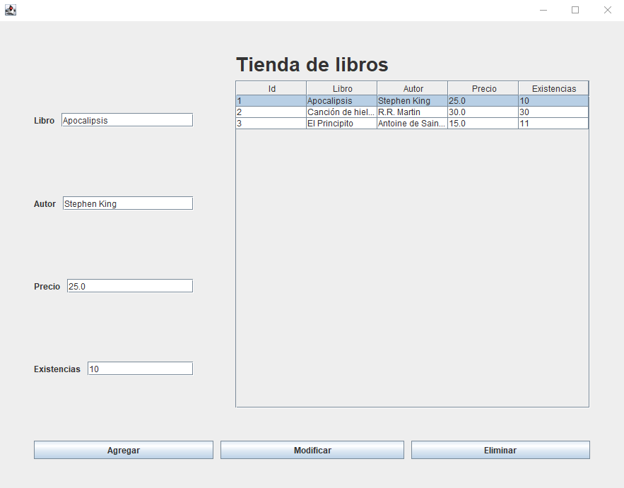

### Aplicación tienda de libros hecha con **Java Swing**, **Spring Boot** y **MySQL**.

- Permite agregar un libro introduciendo el nombre del libro, el autor, el precio y las existencias.
El ID es autoincrementable.
- Podemos modificar el nombre del libro, el autor, el precio y las existencias.
- Y se puede eliminar por el id.

